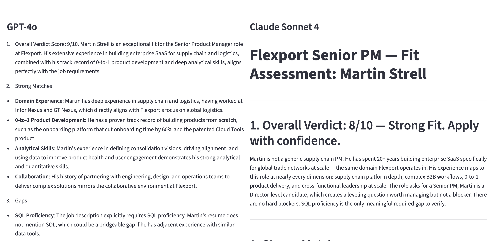

# Job Fit Evaluator

A Streamlit app that evaluates how well a resume matches a job description using GPT-4o and Claude in parallel, synthesizes where the two models agree and disagree, and tracks your application pipeline.



## The Problem

Reading job descriptions and honestly assessing fit is time-consuming and easy to get wrong — candidates over-index on surface matches and miss hard blockers, or talk themselves into applying when they shouldn't. This app gives a structured, direct evaluation from two independent AI models, then surfaces where they diverge and why.

## Features

- **URL fetching** — Paste a job URL instead of the full description. The app scrapes the page, extracts the relevant content, and detects the posting date.
- **Company research** — Automatically searches for funding stage, headcount, recent news, and layoffs via Tavily, and injects the context into the evaluation.
- **Dual model comparison** — GPT-4o and Claude Sonnet run in parallel against the same prompt. Results are displayed side by side.
- **Synthesis** — A third Claude call compares both evaluations: where they agree, where they disagree, and what explains the difference.
- **Pipeline tracker** — Every evaluation is saved automatically to a local SQLite database. Track application status (N/A → Applied → Phone Screen → Interview → Offer → Rejected), view full syntheses, re-evaluate with updated models, and delete stale entries.
- **Resume persistence** — The last pasted resume is saved locally and pre-filled on next launch.

## Tech Stack

| Layer | Tool |
|---|---|
| UI | Streamlit |
| Language models | OpenAI GPT-4o, Anthropic Claude Sonnet 4.6 |
| Company research | Tavily Search API |
| Web scraping | Requests, BeautifulSoup4 |
| Database | SQLite (via Python stdlib) |
| Language | Python 3.11+ |

## Running Locally

**1. Clone and install dependencies**

```bash
git clone <repo-url>
cd job-fit-evaluator
pip install -r requirements.txt
```

**2. Add API keys**

Create `.streamlit/secrets.toml` (already in `.gitignore`):

```toml
OPENAI_API_KEY    = "sk-..."
ANTHROPIC_API_KEY = "sk-ant-..."
TAVILY_API_KEY    = "tvly-..."
```

**3. Run**

```bash
streamlit run app.py
```

The app opens at `http://localhost:8501`. The SQLite database and resume cache are stored in `~/.job-fit-evaluator/`.


## Evaluation Framework

Each evaluation covers: overall verdict with a 1–10 fit score, strong matches, gaps (hard blockers vs. bridgeable vs. preferred), level and culture fit, interview watch-outs, and framing recommendations. The prompt is in `prompt.py`.
